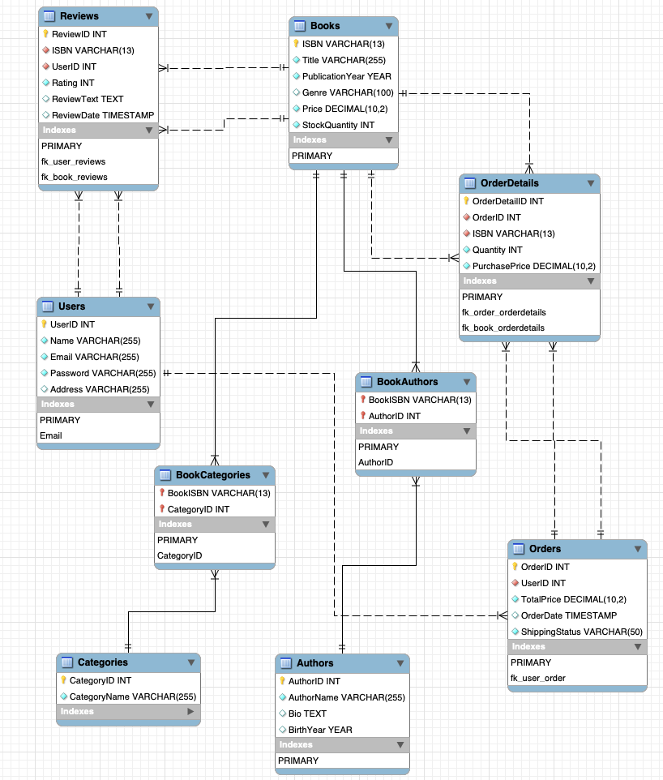

# Online Bookstore Database Project

## Overview
This project is designed to manage the database of an online bookstore. It encompasses an Entity-Relationship Diagram (ERD) for data structure visualization, a fully normalized database schema for efficiency and integrity, and a simple web interface for performing CRUD operations on the database.

## Features
- ER Diagram visually representing the database schema.
- Normalized tables to minimize redundancy and ensure data integrity.
- Implemented data integrity with primary and foreign keys, constraints, and indexes.
- Functional CRUD operations for the Users table through a Flask application.
- SQL queries optimized for performance.
- Clear and maintainable application architecture.

## SQL Code
SQL migration scripts and Flask application code contain optimized SQL statements.

## ER Diagram

The ER diagram illustrates the relationships and cardinalities between entities in the database.

## Normalization
The database schema adheres to the Third Normal Form (3NF), eliminating redundancies and ensuring data integrity.

## Integrity Enforcement
Integrity is enforced with primary keys, foreign keys, unique constraints, and not-null constraints.

## Forms
The Flask application includes basic forms for user interactions, implementing robust data validation and error handling.

## Application Architecture
The project uses an MVC architecture, separating data management, business logic, and UI layers.

## Installation and Setup
Detailed steps for setting up the project can be found in the installation section below.

## Usage
A usage guide is provided to help users interact with the application effectively.

## Requirements
- Python 3.x
- Flask
- PyMySQL
(Refer to `requirements.txt` for a full list of dependencies.)

## License
[Include licensing information here.]

## Credits
[Acknowledge collaborators, third-party assets, or references.]

---

This README outlines the components and structure of the Online Bookstore Database Project, demonstrating how it meets the assignment's criteria.

